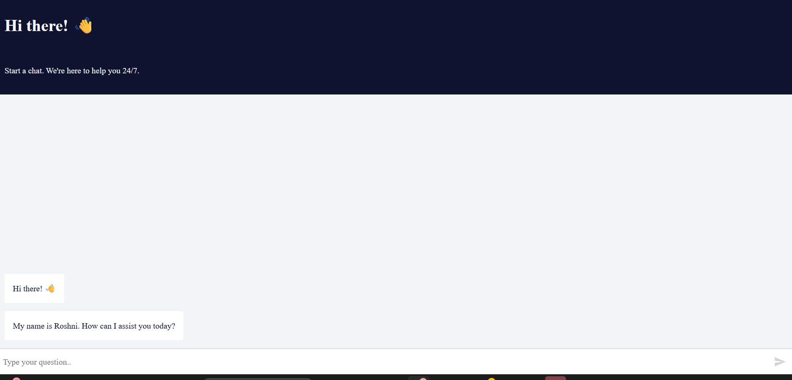

# 🤖 Website Chatbot using n8n

An AI-powered website chatbot built using **n8n**, designed to automatically respond to user queries by fetching information from **Google Sheets**, maintaining conversation context using **Simple Memory**, and collecting user contact details when answers are not available.

---

## 📌 Project Overview

This project implements an intelligent chatbot workflow in **n8n** that triggers whenever a chat message is received from a website. The chatbot uses an **AI Agent** powered by the **Google Gemini Chat Model** to understand user intent, retrieve relevant data from Google Sheets, and provide accurate responses.  

If the chatbot is unable to find an answer, it follows a fallback mechanism to request the user’s **mobile number** for further contact and logs the details for follow-up.

---

## ⚙️ Workflow Architecture

User Message
↓
When Chat Message Received (Trigger)
↓
AI Agent
├── Google Gemini Chat Model
├── Simple Memory
└── Tools
├── Get Course Info (Google Sheets – Read)
├── Get FAQ (Google Sheets – Read)
└── Unanswered Queries + Contact (Google Sheets – Append)

---

## 🛠️ Technologies & Tools Used

- **n8n** – Workflow automation
- **AI Agent** – Query processing and decision-making
- **Google Gemini Chat Model** – Natural language understanding
- **Simple Memory** – Conversation context retention
- **Google Sheets** – Data source and query logging
- **Website Chat Interface** – User interaction

---

## ✨ Key Features

- Real-time chatbot responses on website
- Retrieves course information from Google Sheets
- Answers frequently asked questions (FAQs)
- Maintains conversation history using Simple Memory
- Intelligent fallback handling for unanswered queries
- Collects user mobile number for follow-up contact
- Logs unanswered queries and contact details automatically

---

## 🔁 Fallback & Contact Collection Flow

When the chatbot cannot find a suitable answer:

1. The AI Agent detects that no relevant data is available  
2. The chatbot informs the user politely that the answer is unavailable  
3. The chatbot requests the user’s **mobile number** for follow-up  
4. User query and mobile number are stored in **Google Sheets**  
5. The team can later contact the user and improve the knowledge base  

This ensures no user query is lost and improves overall engagement.

---

## 📂 Google Sheets Structure

### 1️⃣ Course Information Sheet
- Course Name  
- Description  

### 2️⃣ FAQ Sheet
- Question  
- Answer  

### 3️⃣ Unanswered Queries & Contacts Sheet
- User Query  
- Mobile Number  

---

## 🚀 How It Works

1. User sends a message via website chatbot  
2. n8n workflow is triggered  
3. AI Agent processes the query using Gemini Chat Model  
4. Data is fetched from Google Sheets (Course Info / FAQ)  
5. Simple Memory maintains conversation context  
6. If no answer is found, user contact details are collected and logged  

---

## 📸 Screenshots

